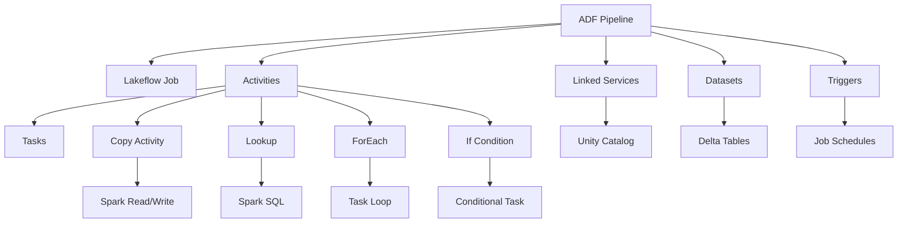

# ADF → Lakeflow Migration Index

## 🎯 Purpose
This knowledge base provides enterprise-grade migration patterns and strategies for converting Azure Data Factory (ADF) pipelines to Databricks Lakeflow and Spark Declarative Pipelines (DLT).

## 📋 Component Mapping Overview

 ADF Component | Lakeflow Equivalent | Migration Complexity | Skill File |
---------------|---------------------|---------------------|------------|
 Pipeline | Lakeflow Job | ⭐⭐ Medium | [adf_pipeline_to_lakeflow_job.md](adf_pipeline_to_lakeflow_job.md) |
 Activity | Task | ⭐⭐ Medium | [adf_activity_to_task.md](adf_activity_to_task.md) |
 Copy Activity | Spark Read/Write | ⭐⭐⭐ High | [adf_copy_activity_to_spark.md](adf_copy_activity_to_spark.md) |
 Lookup Activity | Spark SQL | ⭐⭐ Medium | [adf_lookup_to_spark_sql.md](adf_lookup_to_spark_sql.md) |
 ForEach Activity | Task Loop | ⭐⭐⭐ High | [adf_foreach_to_task_loop.md](adf_foreach_to_task_loop.md) |
 If Condition | Conditional Task | ⭐⭐ Medium | [adf_if_condition_to_task_dependency.md](adf_if_condition_to_task_dependency.md) |
 Linked Service | Unity Catalog | ⭐⭐⭐⭐ Very High | [adf_linked_service_to_unity_catalog.md](adf_linked_service_to_unity_catalog.md) |
 Dataset | Delta Table/Path | ⭐⭐ Medium | [adf_dataset_to_delta_table.md](adf_dataset_to_delta_table.md) |
 Trigger | Job Schedule | ⭐ Low | [adf_trigger_to_job_schedule.md](adf_trigger_to_job_schedule.md) |

## 🏗️ Migration Architecture

```
ADF Pipeline (JSON-based)
    ↓
┌─────────────────────────────────────────┐
│  Metadata Extraction & Analysis         │
│  - Parse ADF JSON                       │
│  - Extract dependencies                 │
│  - Map to Lakeflow concepts            │
└─────────────────────────────────────────┘
    ↓
┌─────────────────────────────────────────┐
│  Component Transformation               │
│  - Pipeline → Job YAML                  │
│  - Activities → Tasks                   │
│  - Linked Services → Unity Catalog     │
│  - Datasets → Delta Tables             │
└─────────────────────────────────────────┘
    ↓
┌─────────────────────────────────────────┐
│  Code Generation                        │
│  - PySpark notebooks                    │
│  - SQL queries                          │
│  - DLT pipelines                        │
└─────────────────────────────────────────┘
    ↓
┌─────────────────────────────────────────┐
│  Validation & Testing                   │
│  - Unit tests                           │
│  - Integration tests                    │
│  - Performance benchmarks               │
└─────────────────────────────────────────┘
    ↓
Lakeflow Job (YAML + PySpark/SQL)
```

## 📊 Dependency Graph



## 🔄 Migration Order (Recommended)

Follow this sequence for optimal migration success:

### Phase 1: Foundation (Week 1-2)
1. **Linked Services** → Unity Catalog connections
2. **Datasets** → Delta table definitions
3. **Triggers** → Job schedule mapping

### Phase 2: Core Logic (Week 3-5)
4. **Copy Activities** → Spark read/write operations
5. **Lookup Activities** → Spark SQL queries
6. **Activities** → Task definitions

### Phase 3: Control Flow (Week 6-7)
7. **If Conditions** → Conditional task dependencies
8. **ForEach** → Dynamic task loops
9. **Pipeline** → Complete job orchestration

### Phase 4: Validation (Week 8)
10. End-to-end testing
11. Performance optimization
12. Production deployment

## 🎨 Design Patterns

### Pattern 1: Medallion Architecture Alignment
```
ADF Bronze → Lakeflow Bronze (Auto Loader + Streaming Tables)
ADF Silver → Lakeflow Silver (Materialized Views)
ADF Gold → Lakeflow Gold (Materialized Views + SCD Type 2)
```

### Pattern 2: Metadata-Driven Migration
- Extract ADF JSON metadata
- Generate Lakeflow YAML dynamically
- Version control all artifacts

### Pattern 3: Incremental Migration
- Migrate pipeline by pipeline
- Run parallel (ADF + Lakeflow) during transition
- Use data quality checks for validation

## 🔐 Security & Governance

 ADF Feature | Lakeflow Equivalent | Implementation |
-------------|---------------------|----------------|
 Managed Identity | Service Principal | Unity Catalog external locations |
 Key Vault | Databricks Secrets | Secret scopes |
 Data Flow encryption | Delta encryption | Transparent encryption at rest |
 Network isolation | Private Link | VNet injection |
 RBAC | Unity Catalog ACLs | Fine-grained permissions |

## 🚀 Automation Framework

### AI Agent Consumption Model

Each skill file follows this structure for AI agents:

```python
{
    "component": "ADF Component Name",
    "target": "Lakeflow Component",
    "transformation_rules": {
        "parse": "JSON extraction logic",
        "map": "Field mapping rules",
        "generate": "Code generation template"
    },
    "validation": "Post-migration checks"
}
```

### Metadata-Driven Approach

```python
# Example: Auto-generate migration plan
def generate_migration_plan(adf_pipeline_json):
    """
    Parse ADF pipeline and generate Lakeflow equivalent
    """
    components = extract_components(adf_pipeline_json)
    
    for component in components:
        skill = load_skill(component.type)
        lakeflow_code = skill.transform(component)
        validate(lakeflow_code)
    
    return lakeflow_job_yaml
```

## 📚 Using This Knowledge Base

### For Engineers
1. Identify ADF component type
2. Open corresponding skill file
3. Follow migration strategy
4. Adapt code templates

### For Architects
1. Review dependency graph
2. Plan migration phases
3. Validate design patterns
4. Define governance model

### For AI Agents (Genie Code)
1. Parse ADF JSON input
2. Load applicable skill files
3. Apply transformation rules
4. Generate Lakeflow code
5. Validate output

## ✅ Success Criteria

- [ ] All pipelines migrated to Lakeflow Jobs
- [ ] All linked services mapped to Unity Catalog
- [ ] All datasets converted to Delta tables
- [ ] Performance benchmarks met or exceeded
- [ ] Data quality validation passed
- [ ] Security and compliance maintained
- [ ] Documentation complete
- [ ] Team training completed

## 🔗 Related Resources

* [Databricks Lakeflow Documentation](https://docs.databricks.com/workflows/)
* [Spark Declarative Pipelines Guide](https://docs.databricks.com/delta-live-tables/)
* [Unity Catalog Overview](https://docs.databricks.com/data-governance/unity-catalog/)
* [Delta Lake Best Practices](https://docs.databricks.com/delta/)

## 📞 Support & Contribution

For questions, issues, or contributions:
* Review individual skill files for detailed guidance
* Follow established patterns and conventions
* Test thoroughly before production deployment

---

**Version:** 1.0  
**Last Updated:** 2026-04-22  
**Maintained By:** Databricks Migration Team
