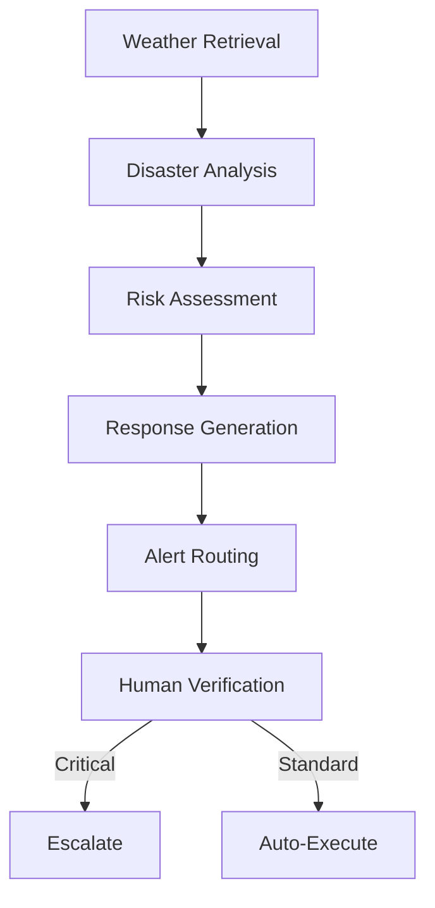

# 🌦️ Weather Monitoring AI Agent

> Production-ready AI Agent for real-time weather monitoring, disaster prediction, and automated emergency response using Databricks best practices

[](https://databricks.com)
[](https://delta.io)
[](https://mlflow.org)
[](https://langchain.com)

## 📋 Table of Contents

* [Overview](#-overview)
* [Architecture](#-architecture)
* [Medallion Architecture](#-medallion-architecture)
* [Key Components](#-key-components)
* [Quick Start](#-quick-start)
* [Data Flow](#-data-flow)
* [Security & Governance](#-security--governance)
* [Best Practices](#-best-practices-implemented)
* [Monitoring](#-monitoring--operations)
* [Technology Stack](#-technology-stack)

## 🎯 Overview

This project implements an enterprise-grade weather monitoring system that:

* **Ingests** real-time weather data from external APIs
* **Processes** and validates data through medallion architecture (Bronze → Silver → Gold)
* **Detects** disaster conditions using threshold-based rules
* **Orchestrates** intelligent responses using LangGraph AI agents
* **Alerts** stakeholders through multi-channel notifications
* **Governs** all assets through Unity Catalog for enterprise-grade security

## 🏗️ Architecture

### Project Structure

```bash
weather_monitoring_ai_agent/
├── 00_README                    # Architecture documentation (this file)
├── 01_config/
│   └── configuration            # Centralized config management
├── 02_data_ingestion/
│   └── bronze_ingestion         # Raw data ingestion (Bronze layer)
├── 03_data_processing/
│   └── silver_processing        # Data transformation (Silver layer)
├── 04_analytics/
│   └── gold_analytics           # Business analytics (Gold layer)
├── 05_uc_functions/
│   └── create_functions         # Unity Catalog function definitions
├── 06_agent/
│   ├── agent_tools              # Python simulation tools
│   └── agent_orchestration      # LangGraph AI agent
├── 07_deployment/
│   └── mlflow_deployment        # Model serving deployment
└── 08_tests/
    └── integration_tests        # End-to-end test suite
```

## 🎯 Medallion Architecture

### Bronze Layer (`02_data_ingestion`)

**Purpose**: Raw data ingestion and archival

* Raw weather API data ingestion
* Append-only Delta tables for full history
* Checksum-based deduplication
* Complete lineage tracking
* No transformations applied

### Silver Layer (`03_data_processing`)

**Purpose**: Cleaned and validated data

* Validated, normalized metrics
* Data quality checks and assertions
* Unit conversions (Kelvin → Celsius)
* Disaster condition flags
* MERGE pattern for Change Data Capture (CDC)
* Type-safe transformations

### Gold Layer (`04_analytics`)

**Purpose**: Business-ready analytics and aggregations

* Disaster event detection logic
* Severity classification and risk scoring
* Daily aggregations for reporting
* Liquid Clustering for query performance
* Optimized for analytical workloads

## 🔧 Key Components

### 1. Configuration Management (`01_config`)

Centralized configuration with environment-specific settings:

```python
config = {
    "env": "prod",
    "catalog": "weather_disaster",
    "schema": "weather_data",
    "api_endpoint": "api.openweathermap.org",
    "alert_thresholds": {...}
}
```

**Features**:

* Environment-specific settings (dev/staging/prod)
* Unity Catalog namespace management
* API endpoints and credential references
* Disaster threshold configuration
* Alert channel routing

### 2. Unity Catalog Functions (`05_uc_functions`)

Governed, auditable SQL functions for agent tool calling:

| Function | Purpose | Example |
|----------|---------|----------|
| `get_current_weather(city_name)` | Current conditions | `SELECT get_current_weather('London')` |
| `get_disaster_history(city_name, days_back)` | Historical events | `SELECT get_disaster_history('Tokyo', 7)` |
| `assess_risk_level(wind, temp, precip)` | Risk assessment | `SELECT assess_risk_level(75, 35, 50)` |
| `get_active_disasters()` | Active disaster list | `SELECT get_active_disasters()` |

**Benefits**:

* ✅ Centralized business logic
* ✅ Version controlled
* ✅ Auditable through UC
* ✅ Reusable across applications

### 3. AI Agent (`06_agent`)

**LangGraph State Machine** with conditional routing:



**Agent Workflow**:

1. **Weather Retrieval** → Fetch data via UC Functions
2. **Disaster Analysis** → Apply threshold checking
3. **Risk Assessment** → Simulate impact scenarios
4. **Response Generation** → LLM-powered action planning
5. **Alert Routing** → Multi-channel notifications (Email, Slack, SMS)
6. **Human Verification** → Critical event review loop

### 4. MLflow Deployment (`07_deployment`)

End-to-end model lifecycle management:

* Model packaging with dependencies
* Unity Catalog model registration
* Model Serving endpoint creation
* Inference table logging for monitoring
* A/B testing support

## 🚀 Quick Start

### Prerequisites

1. **Databricks Workspace** (AWS, Azure, or GCP)
2. **Unity Catalog** enabled
3. **Weather API Key** (OpenWeatherMap or similar)
4. **Serverless Compute** (recommended) or cluster with DBR 14.3+

### Step 1: Create Unity Catalog Resources

```sql
-- Create catalog and schema
CREATE CATALOG IF NOT EXISTS weather_disaster;
CREATE SCHEMA IF NOT EXISTS weather_disaster.weather_data;

-- Grant permissions
GRANT ALL PRIVILEGES ON CATALOG weather_disaster TO `data_engineers`;
GRANT ALL PRIVILEGES ON SCHEMA weather_disaster.weather_data TO `data_engineers`;
```

### Step 2: Configure Secrets

```bash
# Using Databricks CLI
databricks secrets create-scope weather-disaster-secrets
databricks secrets put-secret weather-disaster-secrets weather-api-key
```

### Step 3: Execution Order

Run notebooks in the following sequence:

1. **Configuration**: `01_config/configuration`
   * Set environment variables
   * Validate connectivity

2. **Data Setup**: Bronze → Silver → Gold
   * `02_data_ingestion/bronze_ingestion`
   * `03_data_processing/silver_processing`
   * `04_analytics/gold_analytics`

3. **UC Functions**: `05_uc_functions/create_functions`
   * Create governed SQL functions
   * Test function execution

4. **Agent Setup**: `06_agent/`
   * `agent_tools` - Initialize Python tools
   * `agent_orchestration` - Build LangGraph workflow

5. **Testing**: `08_tests/integration_tests`
   * Validate end-to-end flow
   * Check data quality

6. **Deployment**: `07_deployment/mlflow_deployment`
   * Register model in UC
   * Deploy to Model Serving

## 📊 Data Flow

```
┌─────────────┐
│ Weather API │
└──────┬──────┘
       │
       ▼
┌─────────────────────────────────┐
│  Bronze Layer (Raw Ingestion)   │
│  • Append-only Delta tables     │
│  • Checksum deduplication       │
└──────┬──────────────────────────┘
       │
       ▼
┌─────────────────────────────────┐
│  Silver Layer (Transformation)  │
│  • Validation & normalization   │
│  • Unit conversions             │
│  • Disaster flags               │
└──────┬──────────────────────────┘
       │
       ▼
┌─────────────────────────────────┐
│  Gold Layer (Analytics)         │
│  • Disaster detection           │
│  • Aggregations                 │
│  • Risk scoring                 │
└──────┬──────────────────────────┘
       │
       ▼
┌─────────────────────────────────┐
│  Unity Catalog Functions        │
│  • Governed data access         │
│  • Auditable queries            │
└──────┬──────────────────────────┘
       │
       ▼
┌─────────────────────────────────┐
│  AI Agent (LangGraph)           │
│  • Intelligent orchestration    │
│  • Response planning            │
└──────┬──────────────────────────┘
       │
       ▼
┌─────────────────────────────────┐
│  Alerts (Multi-Channel)         │
│  • Email, Slack, SMS            │
│  • Emergency escalation         │
└─────────────────────────────────┘
```

## 🔐 Security & Governance

### Unity Catalog Integration

* **Catalog-level isolation**: All assets in `weather_disaster` catalog
* **Schema organization**: Logical separation by data layer
* **Table ACLs**: Row and column-level security
* **Function governance**: Centralized business logic
* **Audit logging**: Complete lineage and access tracking

### Secrets Management

```python
# Secure credential retrieval
api_key = dbutils.secrets.get(scope="weather-disaster-secrets", key="weather-api-key")
```

### Best Practices

| Area | Implementation |
|------|----------------|
| **Authentication** | Databricks Secrets for API keys |
| **Authorization** | Unity Catalog RBAC |
| **Audit** | UC audit logs + Delta time travel |
| **Encryption** | At-rest (S3/ADLS) + in-transit (TLS) |
| **Versioning** | Git integration for notebooks |

## 🎓 Best Practices Implemented

### Architecture Patterns

* ✅ **Separation of Concerns**: Single responsibility per notebook
* ✅ **Configuration Management**: Externalized, environment-specific config
* ✅ **Medallion Architecture**: Progressive data refinement (Bronze → Silver → Gold)
* ✅ **Data Quality**: Validation and assertions at every layer
* ✅ **Idempotency**: MERGE operations for reproducible runs

### Data Engineering

* ✅ **Delta Lake**: ACID transactions and time travel
* ✅ **Liquid Clustering**: Optimized for analytical queries
* ✅ **Schema Evolution**: Graceful handling of API changes
* ✅ **Checkpointing**: Exactly-once processing semantics

### Governance & Observability

* ✅ **Unity Catalog**: Centralized governance for all assets
* ✅ **MLflow Tracking**: Experiment and model versioning
* ✅ **Lineage**: End-to-end data flow tracking
* ✅ **Testing**: Comprehensive unit and integration tests

### Performance

* ✅ **Serverless Compute**: Auto-scaling, pay-per-use
* ✅ **Partitioning**: Optimized by date for time-series queries
* ✅ **Caching**: Intermediate results cached in Silver layer
* ✅ **Vectorization**: Spark-native transformations

## 📈 Monitoring & Operations

### Key Metrics

| Category | Metrics |
|----------|----------|
| **Data Quality** | Completeness, freshness, schema drift, outliers |
| **Agent Performance** | Response time, accuracy, tool call success rate |
| **Alert Delivery** | Channel success rate, notification latency |
| **Cost** | API calls/day, compute DBU usage |
| **Errors** | Failed ingestions, validation errors, agent failures |

### Operational Dashboards

Create Lakeview dashboards for:

1. **Data Pipeline Health**: Ingestion rates, error rates, latency
2. **Disaster Detection**: Active alerts, historical trends, severity distribution
3. **Agent Analytics**: Tool usage, LLM costs, execution times
4. **System Performance**: Compute utilization, storage growth

## 🛠️ Technology Stack

| Component | Technology |
|-----------|------------|
| **Platform** | Databricks (Serverless) |
| **Storage** | Delta Lake |
| **Catalog** | Unity Catalog |
| **Compute** | Serverless SQL/Python |
| **LLM** | Databricks Foundation Model (Llama 3.3 70B) |
| **Agent Framework** | LangGraph, LangChain |
| **ML Ops** | MLflow |
| **Orchestration** | Databricks Jobs (optional) |
| **Monitoring** | MLflow, UC Audit Logs |
| **Version Control** | Git (Databricks Repos) |

## 📝 License

[](https://opensource.org/licenses/Apache-2.0)

Copyright 2026 Weather Monitoring AI Agent Contributors

Licensed under the Apache License, Version 2.0 (the "License");
you may not use this file except in compliance with the License.
You may obtain a copy of the License at

    http://www.apache.org/licenses/LICENSE-2.0

Unless required by applicable law or agreed to in writing, software
distributed under the License is distributed on an "AS IS" BASIS,
WITHOUT WARRANTIES OR CONDITIONS OF ANY KIND, either express or implied.
See the License for the specific language governing permissions and
limitations under the License.

### Why Apache 2.0?

This project uses the same license as Apache Spark, ensuring:

* ✅ **Commercial use**: Use freely in commercial applications
* ✅ **Modification**: Modify and adapt the code to your needs
* ✅ **Distribution**: Distribute original or modified versions
* ✅ **Patent use**: Express grant of patent rights from contributors
* ✅ **Private use**: Use privately without disclosure obligation

**Requirements**:
* Include original license and copyright notice
* State significant changes made to the code
* Include NOTICE file if provided

See [LICENSE](LICENSE) file for full terms.

## 🤝 Contributing

We welcome contributions from the community! This project follows Apache Software Foundation contribution guidelines.

### How to Contribute

1. **Fork the repository** and create your branch from `main`
   ```bash
   git clone https://github.com/TRRaveendra/AI-Agents-Databricks.git
   cd AI-Agents-Databricks
   git checkout -b feature/your-feature-name
   ```

2. **Make your changes** following our coding standards:
   * **Python**: PEP 8 style guide, type hints encouraged
   * **SQL**: Consistent formatting with clear comments
   * **Documentation**: Update README and inline comments
   * **Tests**: Add tests for new functionality

3. **Code style examples**:
   ```python
   # Good: Clear function with docstring and type hints
   from pyspark.sql import DataFrame
   from pyspark.sql.functions import col
   
   def flag_disaster_conditions(df: DataFrame, temp_threshold: float = 35.0) -> DataFrame:
       """
       Flag weather records that exceed disaster thresholds.
       
       Args:
           df: Input DataFrame with weather metrics
           temp_threshold: Temperature threshold in Celsius (default: 35.0)
       
       Returns:
           DataFrame with 'is_disaster' boolean column
       
       Example:
           >>> weather_df = spark.table("weather_disaster.weather_data.silver_weather")
           >>> flagged_df = flag_disaster_conditions(weather_df, temp_threshold=40.0)
       """
       return df.withColumn(
           "is_disaster",
           (col("temperature_celsius") > temp_threshold) | 
           (col("wind_speed_kmh") > 75)
       )
   ```

4. **Test your changes**:
   ```bash
   # Run unit tests
   pytest tests/unit/
   
   # Run integration tests in Databricks notebook
   # Open: 08_tests/integration_tests
   ```

5. **Commit with clear messages**:
   ```bash
   git add .
   git commit -m "[Component] Brief description of changes"
   
   # Examples:
   # [Agent] Add retry logic for API timeout failures
   # [Bronze] Implement checksum-based deduplication
   # [Docs] Update quick start guide with prerequisites
   ```

6. **Submit a pull request**:
   * Clear description of changes and motivation
   * Link to related issues: `Fixes #123` or `Relates to #456`
   * Screenshots/logs for UI or behavior changes
   * Ensure CI checks pass

### Development Setup

```bash
# Clone the repository
git clone https://github.com/TRRaveendra/AI-Agents-Databricks.git
cd AI-Agents-Databricks

# Install development dependencies (local testing)
pip install -r requirements-dev.txt

# Import notebooks to Databricks workspace
databricks workspace import-dir . /Users/<your-email>@<company>.com/weather_monitoring_ai_agent
```

### Reporting Issues

Found a bug? Have a feature request?

* **Check existing issues** first to avoid duplicates
* **Use issue templates** when creating new issues
* **Provide context**: 
  * Steps to reproduce
  * Expected vs actual behavior
  * Error logs and stack traces
  * Environment details (DBR version, cluster config)
* **Label appropriately**: `bug`, `enhancement`, `documentation`, `question`

### Code Review Process

1. All submissions require review by maintainers
2. Changes should include appropriate test coverage
3. Documentation must be updated for API changes
4. CI/CD checks must pass before merge

## 🌟 Credits

### Built With

This project leverages best-in-class open source technologies:

* [Apache Spark™](https://spark.apache.org/) - Distributed data processing engine
* [Delta Lake](https://delta.io/) - Open-source ACID storage layer
* [MLflow](https://mlflow.org/) - Open-source ML lifecycle platform
* [LangGraph](https://github.com/langchain-ai/langgraph) - AI agent orchestration framework
* [LangChain](https://github.com/langchain-ai/langchain) - LLM application framework
* [Databricks](https://databricks.com/) - Unified analytics platform

### Acknowledgments

* **Apache Spark** community for the foundational distributed computing framework
* **Databricks** for Unity Catalog, serverless compute, and lakehouse innovations
* **LangChain** team for agent orchestration patterns and tooling
* **OpenWeatherMap** for providing accessible weather data APIs
* All **contributors** who help improve this project

### Related Projects

* [Delta Lake Examples](https://github.com/delta-io/delta-examples)
* [MLflow Examples](https://github.com/mlflow/mlflow/tree/master/examples)
* [LangGraph Examples](https://github.com/langchain-ai/langgraph/tree/main/examples)

---

**Last Updated**: August 19, 2026  
**Version**: 2.0.0  
**License**: Apache-2.0  
**Maintained by**: [@TRRaveendra](https://github.com/TRRaveendra)  
**Repository**: [github.com/TRRaveendra/AI-Agents-Databricks](https://github.com/TRRaveendra/AI-Agents-Databricks)
